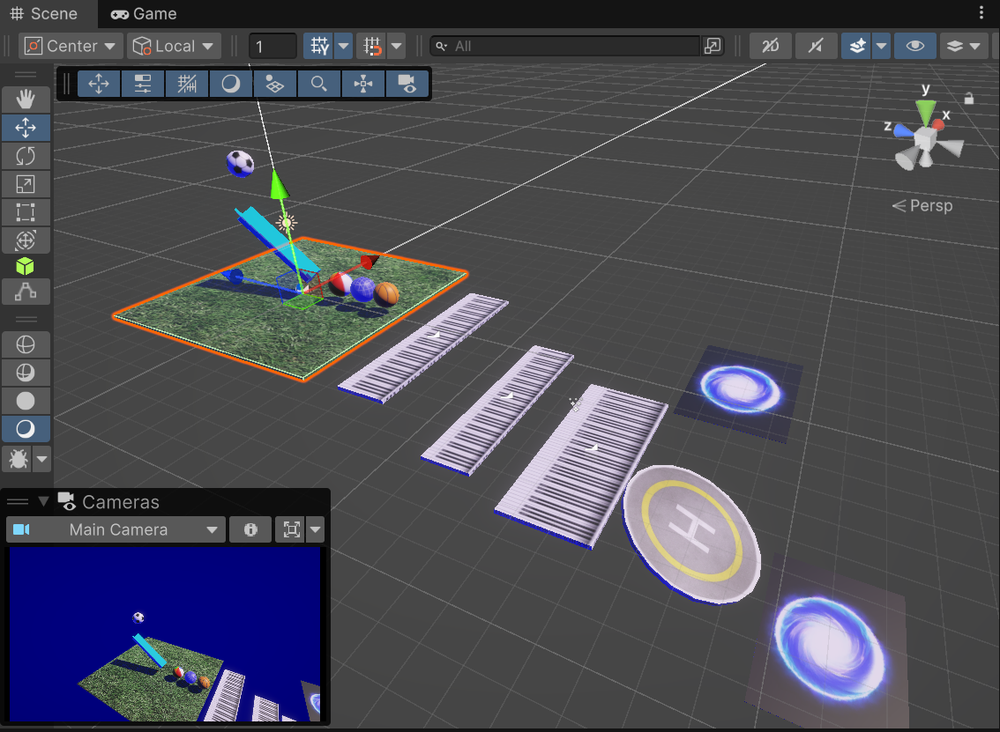

# Rube_Goldberg_Machine



## Part 1
* BallGoBack
* AudioPlay
  * Collision
  * Trigger
* GenericEvent
* CamFollow Ball

## Part 2
* Particle Effects with Events - <a href="https://assetstore.unity.com/packages/vfx/particles/spells/magic-effects-free-247933" target="_blank">free particle Effects</a>
* Trampolin (AddForce)
* Teleporter (position)
* Text Mesh Pro, eigener Font (TTF) <a href="https://www.1001freefonts.com/fixed-width-fonts.php" target="_blank">free fixed width Fonts</a>
  * Time (ms)

## Part 3
* Rounds
* Round Time
* ResetPosition

## Collider & Trigger

```
private void OnTriggerEnter(Collider other)
Debug.Log("Generic Trigger detected with " + other.gameObject.name);

private void OnCollisionEnter(Collision collision)
Debug.Log("Generic Collision detected with " + collision.gameObject.name);
```

## Event Example

```
[SerializeField] private UnityEvent myColliderEventEnter = null;
myColliderEventEnter.Invoke();
```
